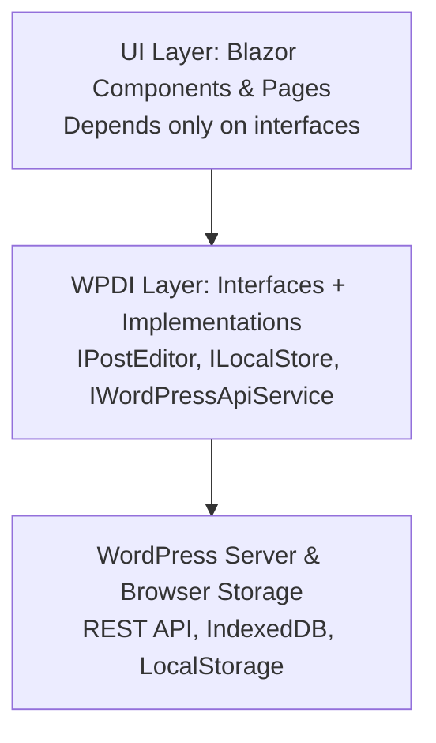

# WPDI Architecture Overview

Our custom CMS is built on **WPDI (WordPress Dependency Injection)** to keep a clean separation between UI, service interfaces, and external systems.

---

## 🔗 Layered Architecture

---

## 🧩 Interfaces

- **`IPostEditor`** → publishing posts (create, update).  
- **`IWordPressApiService`** → reading/querying WordPress data (posts, categories).  
- **`ILocalStore`** → local persistence (IndexedDB for production, InMemory for tests).  

---

## ⚙️ Real Implementations

- `WordPressEditor` → talks to **WordPress REST API** via HttpClient.  
- `WordPressApiService` → configures WordPressPCL client with auth + base URL.  
- `IndexedDbLocalStore` → browser IndexedDB via JSInterop.  

---

## 🎭 Fake Implementations (for xUnit TDD)

- `FakePostEditor` → returns canned `EditResult`.  
- `InMemoryLocalStore` → simple dictionary-based store.  
- (Optional) `FakeWordPressApiService` → returns sample categories/posts.  

These fakes let us run **fast, isolated unit tests**.

---

## 🧪 Testing Strategy

- **xUnit Unit Tests** → run against fakes (fast, local, no WordPress needed).  
- **Integration Tests** → swap in real `WordPressEditor` + `IndexedDbLocalStore` to hit a real WordPress instance and browser APIs.  
- **Playwright E2E Tests** → drive the UI in a browser, verifying full flow (draft → publish → visible on WordPress).  

---

## ✅ Summary

- **UI** → depends only on **interfaces**.  
- **WPDI** → wires those interfaces to either real or fake implementations.  
- **WordPress/Browser** → only touched by real implementations.  

This separation makes the system **stupid simple** to test and extend.
